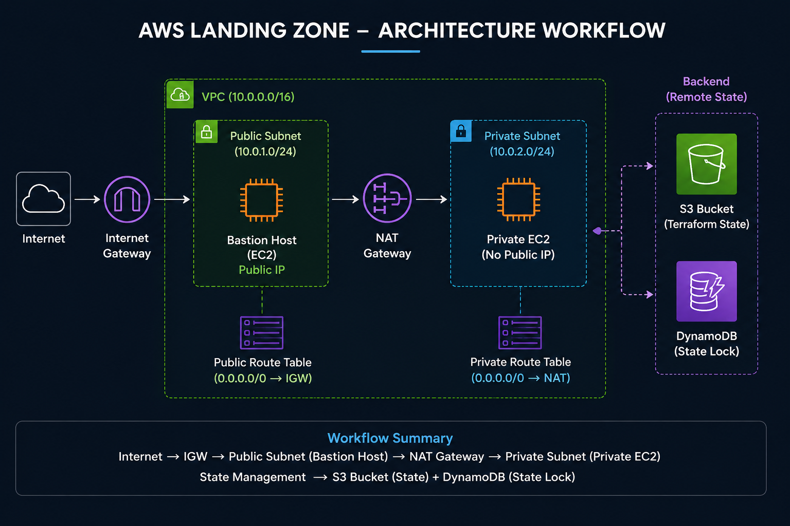
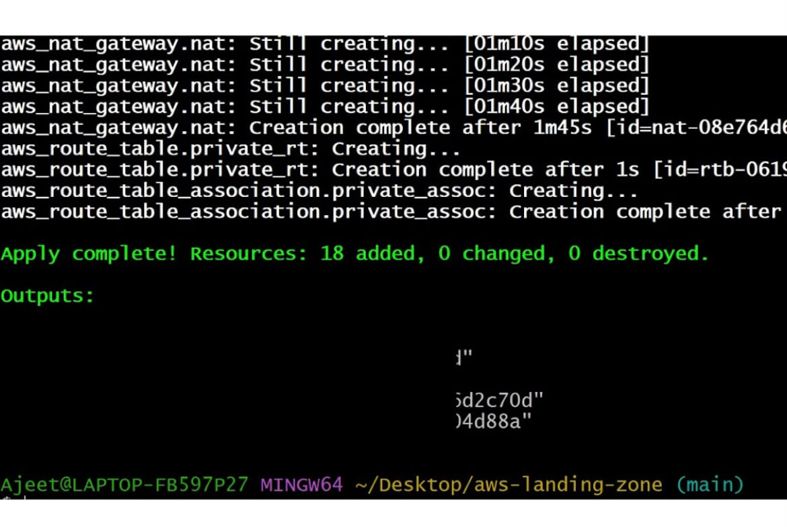
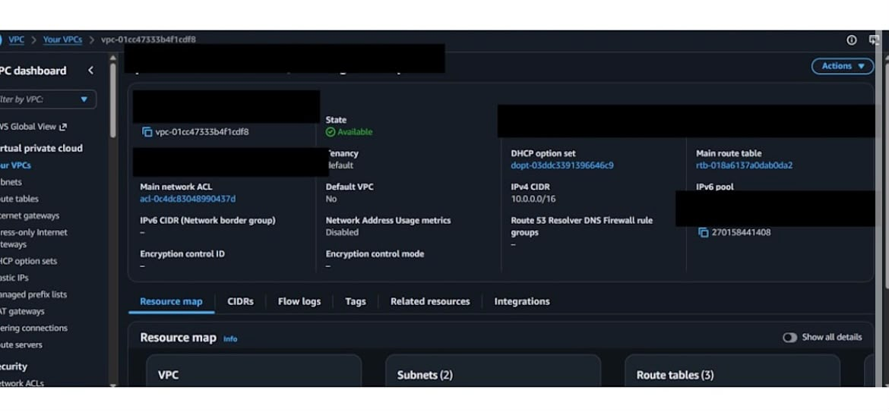
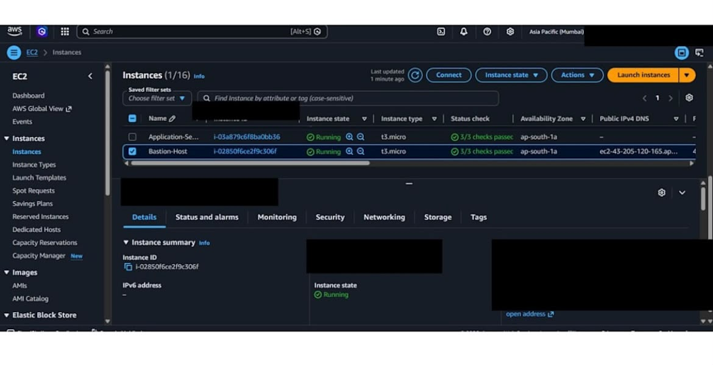
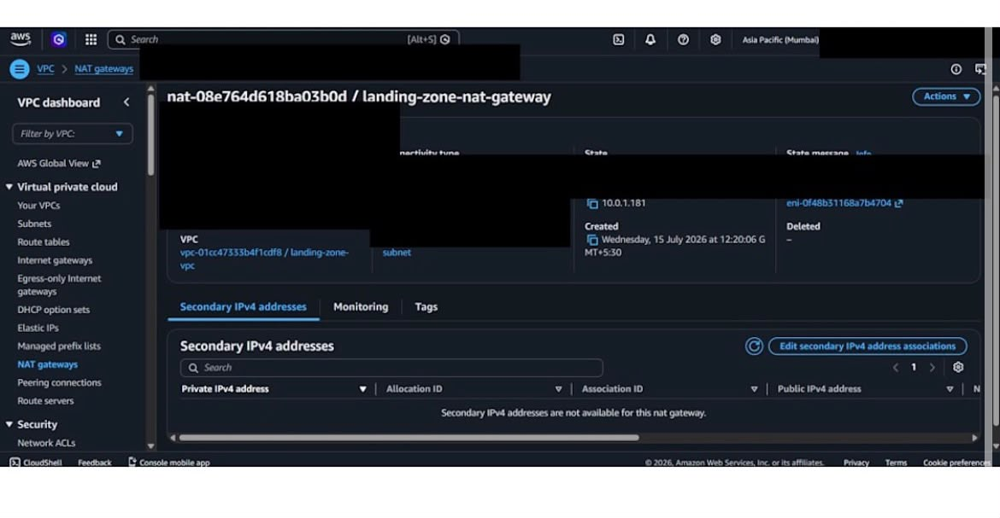

# 🚀 AWS Landing Zone using Terraform

<p align="center">
  
</p>

<p align="center">
  
  
  
  
  
</p>

---

# 📖 Overview

This project demonstrates how to build a secure and scalable AWS Landing Zone using **Terraform** by following Infrastructure as Code (IaC) best practices.

The infrastructure includes networking, compute resources, IAM configuration, and remote Terraform state management.

---

# ✨ Features

- 🌐 Custom VPC
- 📡 Public & Private Subnets
- 🌍 Internet Gateway
- 🔄 NAT Gateway
- 🛣 Route Tables & Associations
- 🔐 Security Groups
- 🖥 Bastion Host (Public EC2)
- 🔒 Private EC2 Instance
- 👤 IAM Role & Instance Profile
- ⚙️ Terraform Variables & Outputs
- ☁️ Remote Backend using Amazon S3
- 🔒 Terraform State Locking using DynamoDB

---

# 🛠️ Technologies Used

- Terraform
- AWS VPC
- Amazon EC2
- IAM
- Amazon S3
- DynamoDB
- Git
- GitHub

---

# 📂 Project Structure

```text
aws-landing-zone-terraform/
│
├── backend.tf
├── provider.tf
├── variables.tf
├── terraform.tfvars
├── main.tf
├── outputs.tf
├── README.md
│
└── images/
    ├── architecture.png
    ├── terraform-apply.png
    ├── vpc-dashboard.png
    ├── resource-map.png
    ├── ec2-instance.png
    └── nat-gateway.png
```

---

# 🌐 Architecture Workflow

```
Internet
    │
    ▼
Internet Gateway
    │
    ▼
Public Subnet
    │
Bastion Host
    │
    ▼
NAT Gateway
    │
    ▼
Private Subnet
    │
Private EC2
```

Terraform Backend

```
Terraform
     │
     ▼
Amazon S3
(State File)
     │
     ▼
Amazon DynamoDB
(State Locking)
```

---

# 📸 Project Screenshots

## Terraform Apply



---

## VPC Dashboard




## Bastion Host EC2



---

## NAT Gateway



---

# 🚀 Deployment

Clone the repository

```bash
git clone https://github.com/as9556641-svg/aws-landing-zone-terraform.git
```

Initialize Terraform

```bash
terraform init
```

Validate Configuration

```bash
terraform validate
```

Generate Execution Plan

```bash
terraform plan
```

Deploy Infrastructure

```bash
terraform apply
```

Destroy Infrastructure

```bash
terraform destroy
```

---

# 🔐 Remote Backend

Terraform state is stored securely in **Amazon S3**.

State locking is managed using **Amazon DynamoDB** to prevent concurrent modifications.

---

# 📚 Key Learnings

- Infrastructure as Code (Terraform)
- AWS Networking
- VPC Design
- Public & Private Subnets
- Bastion Host Architecture
- IAM Roles
- Terraform State Management
- Remote Backend Configuration
- Infrastructure Automation

---

# 🚀 Future Improvements

- Terraform Modules
- GitLab CI/CD Pipeline
- CloudWatch Monitoring
- Multi-Environment Support (Dev / Stage / Prod)

---

# 👨‍💻 Author

**Ajeet Singh**

- GitHub: https://github.com/as9556641-svg

---

⭐ If you found this project useful, feel free to star the repository.
